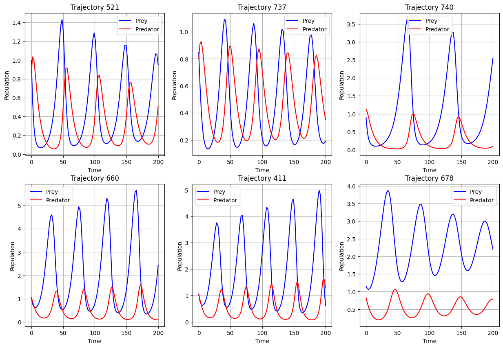
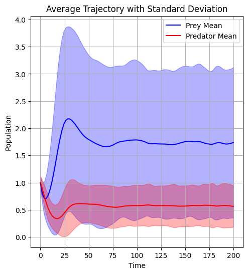
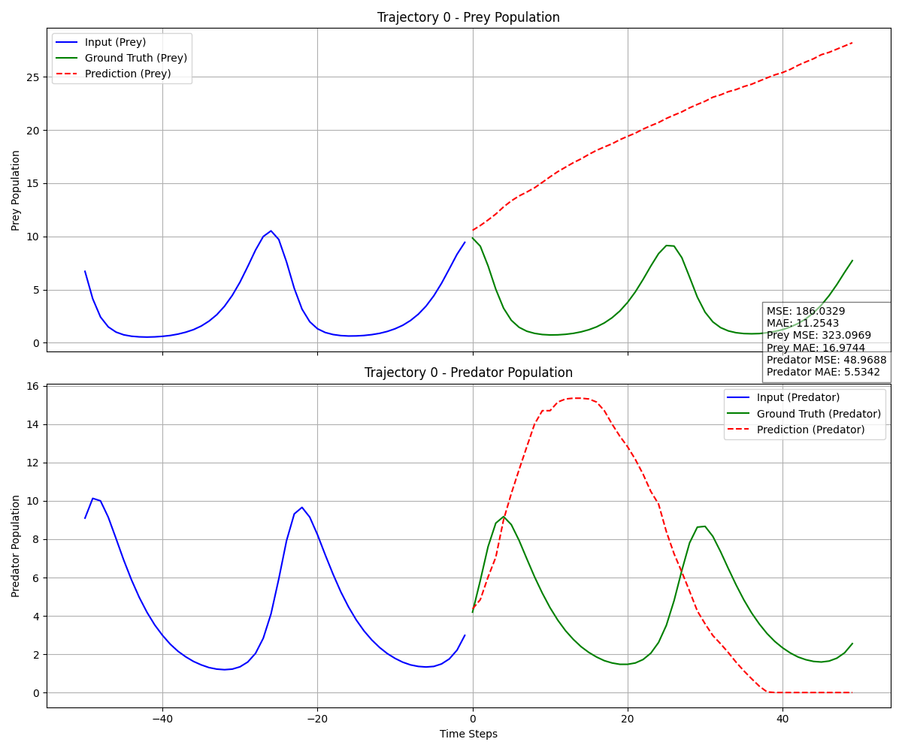
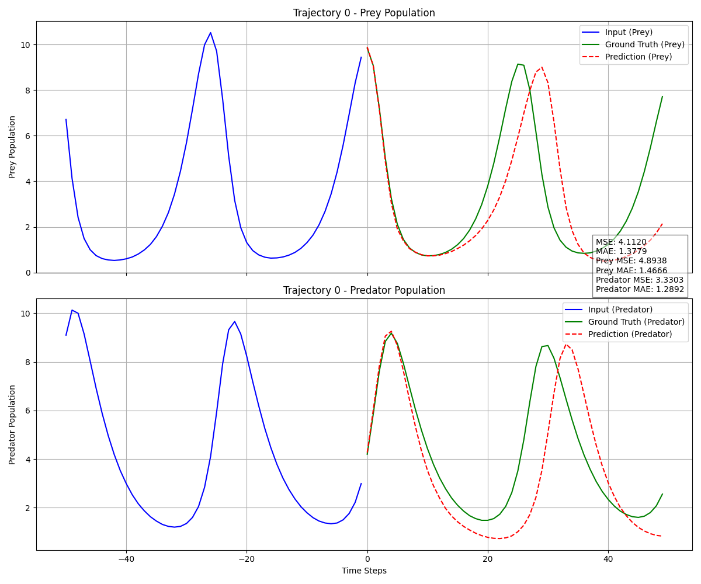
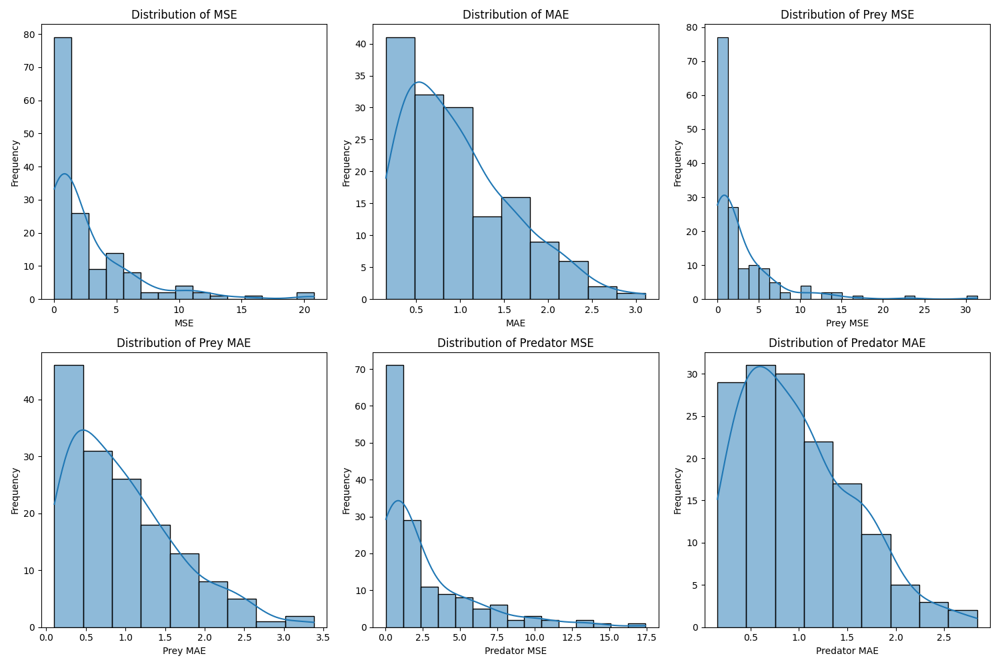

# ML Forecasting Project

A project for fine-tuning and evaluating language models on numerical forecasting tasks using Low-Rank Adaptation (LoRA).

## AI Declaration
GitHub Copilot was used during development to assist with code completion, function documentation, and debugging. All AI-generated code underwent thorough review to ensure correctness, adherence to project requirements, and proper error handling. The core algorithms and methodological decisions remain my intellectual contribution, with Copilot serving only as a productivity tool for implementing standard techniques and reducing time spent on repetitive coding tasks.

## Overview

This project explores the capabilities of foundation models like Qwen2.5 for numerical time-series forecasting, specifically for predator-prey dynamics. Building upon the observation from Gruver et al. (2023) that Large Language Models can be used as time series forecasters without further training, we demonstrate how parameter-efficient fine-tuning can significantly improve performance on specialized forecasting tasks.


### Key Contributions

* Demonstrating the feasibility of adapting LLMs for numerical forecasting with minimal parameter updates
* Insights into optimal context lengths and text formatting for numerical data
* A comprehensive framework for tracking computational usage during model adaptation and inference
* Implementation of LLMTIME preprocessing scheme for effective time series representation as text
* Systematic exploration of hyperparameters for LoRA fine-tuning under computational constraints

## Installation

### Requirements

* Python 3.9+
* PyTorch 2.6+
* CUDA-compatible GPU (recommended)
* 16GB+ RAM

### Setup

```bash
# Clone the repository
git clone https://gitlab.com/your-username/M2_coursework.git
cd M2_coursework

# Create and activate a virtual environment
python -m venv venv
source venv/bin/activate  # On Windows: venv\Scripts\activate

# Install dependencies
pip install -r requirements.txt
```

## Methodology
Our approach involves fine-tuning pre-trained language models (specifically Qwen2.5) using Low-Rank Adaptation (LoRA) for numerical forecasting tasks. The methodology includes:

* **Base Model Evaluation**: Assess the zero-shot forecasting capability of Qwen2.5-0.5B-Instruct
* **Preprocessing**: Implement the LLMTIME preprocessing scheme to convert numerical time series into text format
* **Hyperparameter Search**: Systematically test variations in (use 128 context length):

    * Learning rates: 1e-5, 5e-5, 1e-4
    * LoRA ranks: 2, 4, 8
    * Precision values: 2, 3 decimal places

* **Context Length Study**: Evaluate different input context lengths (128, 512, 768 tokens)
* **Final Model Training**: Train with optimal hyperparameters (LR=1e-4, Rank=8, Context=512)
* **Evaluation**: Assess performance using MAE, RMSE, and detailed FLOP tracking

We use LoRA to modify only a small subset of model parameters:

* Rank: r=8
* Scaling factor: α=16
* Target modules: Query and Value projection matrices
* Total trainable parameters: <1% of full model


## Dataset
We use the Lotka-Volterra dataset that models predator-prey population dynamics:
* 1,000 trajectory samples
* 100 time points per trajectory
* 2 variables per time point (prey and predator populations)

Data is converted to text format for language model processing with appropriate formatting and precision. The following plots contain samples from the dataset and an overview of the distribution.






## Project Structure
```
M2_coursework/
├── data/                  # Data files
├── docs/                  # Documentation
├── experiments/           # Experiment scripts
│   ├── eval/              # Evaluation scripts
│   ├── finetune/          # Fine-tuning scripts
│   └── hyperparameter/    # Hyperparameter search
├── notebooks/             # Jupyter notebooks
├── results/               # Results and visualizations
├── src/                   # Source code
│   ├── data/              # Data processing
│   ├── evaluation/        # Evaluation utilities
│   └── models/            # Model implementations
└── utils/                 # Utility functions
```
## Reproducibility
### Hardware and Computational Requirements
#### Hardware Specifications
We conducted our experiments using the following hardware:
* **Training**: NVIDIA A100 GPU with 40GB VRAM (colab/CSD3)
* **Inference**: Apple M1 Pro chip with 16GB unified memory
* **Storage**: Minimum 50GB for datasets, model checkpoints, and results
  
####  Computational Time
| Experiment | Hardware| Approx Time |
|----------|----------|----------|
| Hyperparameter Search |A100 GPU |4.5 hours |
| Context Length Study| A100 GPU | 1 hour|
|Final Model Training|A100 GPU|50 minutes|

Our experiments were designed to be computationally efficient, enabling the entire pipeline to be run on a single GPU within a reasonable timeframe. The hyperparameter search phase was the most computationally intensive, but with our efficient FLOP tracking implementation, we were able to explore a wide range of configurations while staying well within our computational budget.

1. **Data Processing**
Process the raw data with different precision settings:
```
# Process with 2 decimal places
python src/data/preprocess_data.py --precision 2 --alpha 10.0 --output_dir data/processed2

# Process with 3 decimal places
python src/data/preprocess_data.py --precision 3 --alpha 10.0 --output_dir data/processed3
```

**Parameters explained**:
```
--precision: Number of decimal places (2 or 3)
--alpha: Scaling factor for numerical values (10.0)
--output_dir: Directory to save processed data
```
2. **Baseline Model Evaluation**:
Evaluate the zero-shot performance of the untrained Qwen2.5 model:
```
# Evaluate baseline with precision 2
python experiments/eval/base_eval_v3.py \
  --use_text_files \
  --text_file_path data/processed2/test_texts.txt \
  --num_samples 50 \
  --precision 2 \
  --visualize_first_n 5

# Evaluate baseline with precision 3
python experiments/eval/base_eval_v2.py \
  --use_text_files \
  --text_file_path data/processed3/test_texts.txt \
  --num_samples 50 \
  --precision 3 \
  --visualize_first_n 5
```
**Parameters explained**:
```
--use_text_files: Use preprocessed text files instead of raw HDF5 data
--text_file_path: Path to the test data file
--num_samples: Number of test trajectories to evaluate (50)
--precision: Decimal precision to use (2 or 3)
--visualize_first_n: Number of predictions to visualize (5)
```

If we would like to change the eval for different precision, remember to change the precision accordingly for *Data_Dir* in the *src/eval/visualization.py*

These commands evaluate the untrained model's forecasting ability on both precision settings, generating metrics and visualizations in the results/ directory.

3. **Hyperparameter Search**:
Run a grid search over learning rates, LoRA ranks, and precision values:
```
python experiments/hyperparameter/hyper.py --max_flops 1e17 --use_wandb
```

**Parameters explained**:
```
--max_flops: Maximum FLOP budget (10^17)
--use_wandb: Enable Weights & Biases tracking for visualization
```

Each configuration trains for up to 2,000 steps. Results are saved to results/hyperparameter_search/ and tracked in Weights & Biases.

4. **Context Length Study**:
```
python experiments/context/context.py \
--model_1 \
--lr 1e-4 \
--rank 8 \
--precision 2
```

**Parameters explained**:
```
--model_1: Use the best model from hyperparameter search
--lr: Learning rate (1e-4)
--rank: LoRA rank (8)
--precision: Precision value (2)
```
This script evaluates context lengths of 128, 512, and 768 tokens, starting from the best model's weights. Results are saved to results/context_length_finetuning/.

5. **Final Model Training**:
Train the final model with optimal hyperparameters:
```
python experiments/finetune/finetune.py \
  --train_file data/processed2/train_texts.txt \
  --val_file data/processed2/val_texts.txt \
  --output_dir results/final-finetune/models \
  --lora_r 8 \
  --lora_alpha 16 \
  --learning_rate 1e-4 \
  --batch_size 4 \
  --max_steps 15000 \
  --max_length 512 \
  --eval_steps 500 \
  --save_steps 500 \
  --max_flops 1e17 \
  --use_wandb \
  --wandb_project lora-finetuning_final
```
6. **Final Evaluation**:
Evaluate the fine-tuned model on the test set:
```
python experiments/eval/finetune_eval.py \
  --use_text_files \
  --text_file_path data/processed2/test_texts.txt \
  --num_samples 50 \
  --precision 2 \
  --visualize_first_n 20
``` 

## Training Visualization

We tracked our experiments using Weights & Biases. View our interactive dashboards:

- [Hyperparameter Search Dashboard](https://wandb.ai/xxq_010223-university-of-cambridge/lora-hyperparameter-search?nw=nwuserxxq_010223)
- [Context Length Experiments](https://wandb.ai/xxq_010223-university-of-cambridge/lora-context-length-finetuning?nw=nwuserxxq_010223)
- [Final Model Training](https://wandb.ai/xxq_010223-university-of-cambridge/lora-finetuning_final?nw=nwuserxxq_010223)


## Documentation
For complete documentation, build the Sphinx docs:
```
cd docs
make html
open _build/html/index.html
```

## Flop Accounting
A key aspect of this project was operating under a computational budget of 10^17 floating point operations (FLOPS). We implemented a detailed FLOP tracking system with the following components:

### FLOP Calculation Methodology
* **Forward Pass**: Calculated FLOPS for each operation (matrix multiplications, activations, normalization) in the model
* **Backward Pass**: Estimated as 2x the forward pass FLOPS

### Experimental FLOP Usage
| Experiment Type | Number of Runs | Total FLOPS Used | % of Budget |
|----------|----------|----------|----------|
| Hyperparameter Search | 18 | 5.0e16 |50% |
| Context Length Study | 3 | 1.5e16 |15% |
| Final Model Training | 1 | 3.5e16 |35% |
| Total | 22 | Row 2, Col 3 |1e17 |100% |

Our FLOP tracking allowed us to maximize experimental insights while remaining within the computational budget, emphasizing the importance of efficient resource allocation in modern ML research.


## Results
### Performance Comparison
| Model| Precision | Overall MAE | Prey MAE |Predator MAE
|----------|----------|----------|----------|----------|
| Baseline (Untrained) | 2 |  357.22 |221.86 |492.58 |
| Bseline (Untrained)| 3 | Row 2, Col 3 |RRow 1, Col 3 |Row 1, Col 3 |
| Qwen2.5 + LoRA (Ours) | 2|0.97 |0.96 |0.98 |

The LoRA fine-tuned model achieved:


* When compared to the precision 2 baseline, our model shows a dramatic >99.9% improvement across all metrics
* Success Rate: 100% (49/50 trajectories successfully generated)
* Trainable Parameters: 242,688 (0.048% of the model's 0.5B parameters)


### Visualization 
#### Baseline Model Predictive Power


Predictions from the untrained Qwen2.5 model using precision 2, showing reasonable but imprecise forecasting ability.
#### Fine-tuned Model Performance

Example of a fine-tuned model prediction on a test trajectory, demonstrating the model's ability to capture both the short-term fluctuations and long-term trends in the predator-prey dynamics.




*Distribution of prediction errors across prey and predator populations after fine-tuning, showing the model's error patterns. The histogram reveals that most predictions have MAE error within ±3 units of the true values, with prey population estimates being slightly more accurate than predator population estimates.*

## Insights
Our experiments revealed several key insights:

1. **LLMs for Numerical Forecasting**: Even without specific training, large language models like Qwen2.5 demonstrate a surprising capability to extrapolate numerical patterns, suggesting they learn generalizable pattern recognition during pre-training.
2. **Efficient Fine-tuning**: LoRA provides an extremely parameter-efficient approach to specializing LLMs for numerical tasks. By modifying just 0.048% of the parameters, we achieved a dramatic improvement in forecast accuracy.

3. **Hyperparameter Impact**:

    * **Learning Rate**: Higher learning rates (1e-4) performed better than lower ones, suggesting the adaptation requires significant updates to the low-rank matrices.
    * **LoRA Rank**: Higher ranks (r=8) consistently outperformed lower ranks, indicating that the adaptation requires a more expressive parameter space.
    * **Precision**: 2 decimal places provided the best performance, balancing detail with token efficiency.

4. **Context Length Trade-offs**: While longer contexts provided more historical information, the performance improvements plateaued after 512 tokens. This suggests the model primarily relies on recent history for forecasting.

## References

*Gruver, N., Finzi, M., Qiu, S., & Wilson, A. G. (2023). Large Language Models Are Zero-Shot Time Series Forecasters. In Neural Information Processing Systems (NeurIPS 2023).*