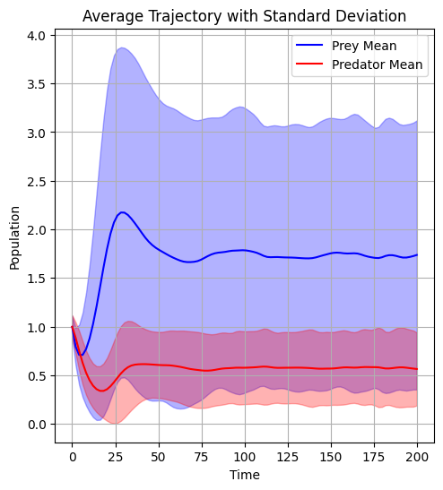

Lotka-Volterra Dataset
=====================

The Lotka-Volterra dataset contains simulated predator-prey dynamics, generated using the Lotka-Volterra equations. This dataset is designed for testing and evaluating machine learning models in the context of time series prediction and clustering.

Sample Trajectories
------------------

.. figure:: ../../results/data_analysis/sample.png
   :alt: Sample trajectory
   :width: 600px
   
   Sample time series showing prey (blue) and predator (red) population dynamics in one example system.

Dataset Overview
--------------

   
   Overview of the distribution patterns across the dataset.

Dataset Structure
--------------

The dataset is stored in HDF5 format with the following structure:

* **File**: ``lotka_volterra_data.h5``
* **Contents**:
  * ``trajectories``: Array of shape (1000, 100, 2) containing:
    * 1,000 different predator-prey trajectories
    * 100 time points per trajectory
    * 2 variables per time point (prey and predator populations)
  * ``time``: Array of shape (100,) containing time points

Data Characteristics
------------------

From exploratory analysis, we observe:

* **Population Range**:
  * Prey populations range from 0.5 to 2.5 (approximately)
  * Predator populations range from 0.2 to 2.0 (approximately)
  
* **Oscillation Patterns**:
  * Most trajectories show cyclical behavior
  * Average cycle period: 5-10 time units
  * Phase difference between prey and predator cycles: approximately 0.25 (90 degrees)

* **Clustering Analysis**:
  * Trajectories naturally cluster into distinct patterns
  * Clusters differ primarily by oscillation period and amplitude