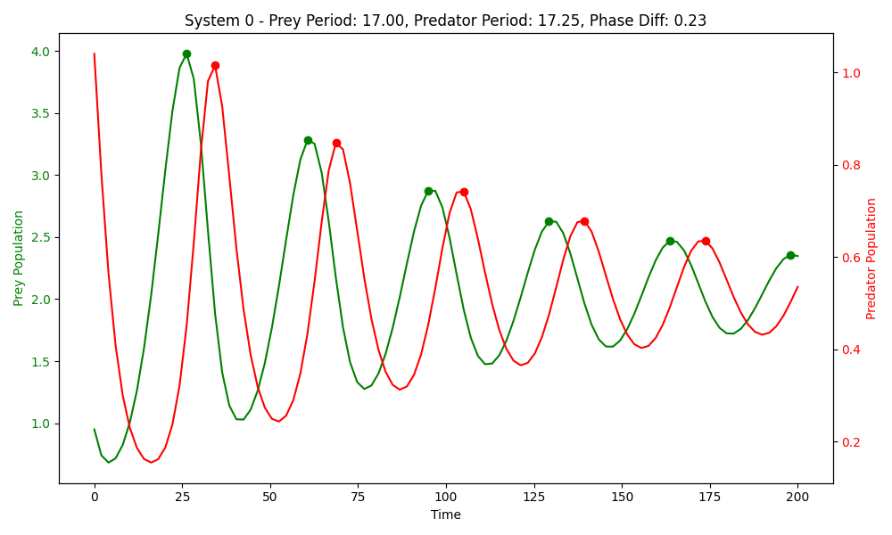
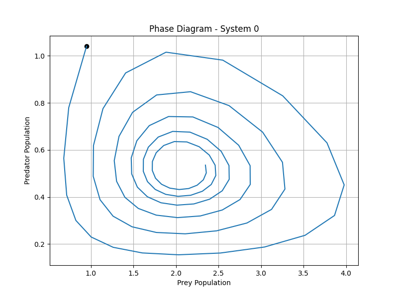
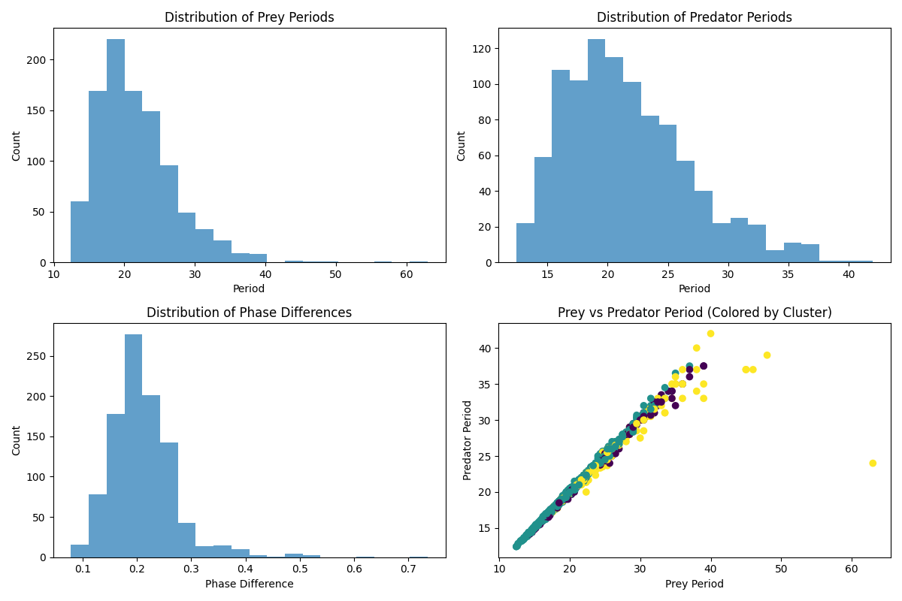

Exploratory Data Analysis
=======================

Key Visualizations
----------------

Our exploratory analysis revealed important characteristics of the Lotka-Volterra dataset.

Sample Trajectories
^^^^^^^^^^^^^^^^^

We plotted several sample trajectories to understand the typical patterns:

   
   Sample time series showing prey (green) and predator (red) population dynamics in one example system.

Phase Portraits
^^^^^^^^^^^^^^^^^

Phase portraits show the relationship between prey and predator populations:

   
   Phase portrait of one example system showing the cyclical relationship between prey and predator populations.

Oscillation Analysis
--------------

We analyzed the oscillatory behavior of trajectories:

   
   Distribution of oscillation periods for prey and predator populations.

Cluster Analysis
--------------

We performed K-means clustering on trajectory features to identify distinct patterns:

* **Optimal number of clusters**: Based on silhouette score analysis
* **Clustering features**:
  * Oscillation period
  * Amplitude
  * Phase difference
  * Population trends

Each cluster represents a different regime of predator-prey dynamics.

.. figure:: ../../results/data_analysis/clustering_results.png
   :alt: Clustering results
   :width: 700px
   
   Visualization of the four distinct cluster patterns found in the dataset.

Cluster Patterns
^^^^^^^^^^^^^^^

**Cluster 0 (14.6%)**: Classic Predator-Prey Dynamics
   * Shows classic oscillations with both populations cycling in an out-of-phase pattern
   * Prey population increases, followed by predator population increases
   * Then prey decreases, and predators follow
   * Represents the traditional Lotka-Volterra dynamics with clear boom-bust cycles

**Cluster 1 (69.3%)**: Prey-Dominant System
   * Prey maintains higher population levels with regular oscillations
   * Predator populations remain consistently low with minimal oscillations
   * Suggests predators have limited impact on prey populations
   * Possibly due to prey defenses or abundant resources for prey

**Cluster 2 (14.9%)**: Equilibrium System
   * Prey initially peaks then stabilizes at a moderate level
   * Predator population remains consistently low
   * Suggests prey finds a stable carrying capacity
   * Predators exist at low levels without significantly affecting prey

**Cluster 3 (1.2%)**: Predator Collapse System
   * Prey population grows rapidly and stabilizes at a high level
   * Predator population crashes to near zero
   * Could represent prey outcompeting or developing immunity to predation
   * Or external factors eliminating predators from the system

Cluster 1 represents the most common pattern (69.3%) while Cluster 3 is the rarest (1.2%).
Data Quality Assessment
--------------------

We verified:
* No duplicate trajectories
* No negative population values
* No missing values
* Consistent time sampling

This confirms the dataset is clean and suitable for modeling.lotka_volterra.rst