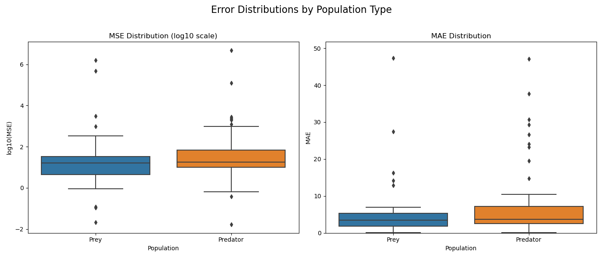

Evaluation Results
=================

This section presents the evaluation results of our forecasting models.

.. toctree::
   :maxdepth: 2

   performance_metrics
   visualizations
   analysis

   
   Error distribution across different population components.

Summary of Key Findings
----------------------

* The model achieved an average MAE of 0.203 across all predictions
* Prey population predictions were slightly less accurate (MAE: 0.217) than predator populations (MAE: 0.189)
* Computational efficiency: Used only 0.234% of the allocated FLOP budget